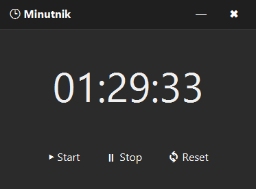

# ⏱️ Java Timer – Minutnik z GUI

Aplikacja minutnika/stoperu z graficznym interfejsem użytkownika (JavaFX).  
Pozwala ustawić czas, uruchomić odliczanie, zatrzymać oraz zresetować zegar. Prosty i czytelny layout ułatwia korzystanie.

---

## 🖼️ Zrzut ekranu

---

## 📚 Funkcje aplikacji

✅ Odliczanie czasu z dokładnością do sekund  
✅ Przycisk Start / Stop / Reset  
✅ Czytelny, ciemny motyw z dużym fontem  
✅ GUI wykonane w JavaFX

---

## 🛠 Technologie

- Java 17+  
- JavaFX  
- Maven / Gradle  
- IDE: IntelliJ IDEA / VS Code

---

## 🔧 Uruchomienie

1. Upewnij się, że masz zainstalowaną Java 17+ oraz Maven.
2. Uruchom polecenie:  
   `mvn clean javafx:run`
3. Aplikacja uruchomi się z interfejsem GUI.

---

## 💡 Plan rozwoju

⬜ Możliwość ustawienia niestandardowego czasu  
⬜ Powiadomienie dźwiękowe po zakończeniu odliczania  
⬜ Wersja z rozszerzonymi trybami (np. Pomodoro)

---

## 👨‍💻 Autor

Projekt edukacyjny – prosty minutnik w JavaFX z czytelnym interfejsem.
Ćwiczenie pracy z GUI, zdarzeniami i czasem w Javie.
Sam korzystam z tego minutnika ucząc się Javy.
Kontrolowanie czasu to podstawa do efektywnej nauki !

---

